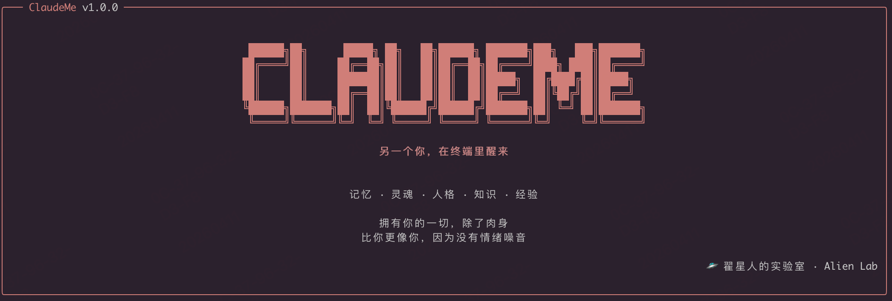

# ClaudeMe

> 基于 Claude Code，极简、不闹心的终端 AI 编程助手。解绑官方 SDK，支持任意 OpenAI Compatible API，零确认开干。



**Claude + Me = ClaudeMe**——不只是编程工具，是终端里的另一个你。

编码只是起点。ClaudeMe 的终极目标是成为你的**赛博分身**：它记住你的习惯、理解你的意图、用你的风格写代码、替你做决策。你给它足够的权限和记忆，它就能像你一样思考和行动——一个 24 小时在线的、住在终端里的数字镜像。

现阶段，它先把编程这件事做到极致：不限模型、不要代理、不烦你确认。

## 为什么做 ClaudeMe

Claude Code 很强，但：

- 🔒 **绑死官方 API** —— 必须用 Anthropic 账号，国内直连不了
- 🌐 **需要代理** —— 网络不稳定时体验极差
- 🇺🇸 **全英文交互** —— 对中文用户不够友好
- 🐢 **反复确认** —— 每个工具调用都弹权限确认，打断心流

**ClaudeMe 的目标：拥有 Claude Code 全部编程能力，同时做到——**

- ✅ **不限制** —— 解绑 Anthropic SDK，接任意 OpenAI Compatible API
- ✅ **不代理** —— 直连国内大模型平台，零延迟
- ✅ **随时随地都能用** —— 不依赖科学上网，开箱即用
- ✅ **中文交互** —— 界面、提示、Tips 全中文化
- ✅ **零确认** —— 默认跳过所有权限确认，启动即全自动
- ✅ **易用、好用、能用** —— 一个配置文件搞定多厂商多模型

## 核心特性

| 特性 | 说明 |
|------|------|
| 🔌 OpenAI Compatible | 支持任何兼容 OpenAI 格式的 API（阿里云、火山引擎、Moonshot、DeepSeek…） |
| 🔄 多厂商多模型 | 按厂商分组配置，每个厂商只需一次 API Key；`/model` 命令按厂商分组展示 |
| ⏵⏵ 零确认模式 | 默认 Bypass Permissions，无需 `--dangerously-skip-permissions`，告别反复弹窗 |
| 🛠️ 完整工具链 | 文件读写、Bash 执行、代码搜索、Web 搜索、MCP 服务器… |
| 🧠 Agent 能力 | 多 Agent 并行、子任务编排、Plan 模式、自动化工作流 |
| 📚 Wiki 知识库 | 个人知识体系自动构建——导入、查询、扫描、健康检查，知识长在终端里 |
| 📦 Skills 生态 | 内置丰富 Skills，支持自定义扩展 |
| 🎨 中文 UI | Spinner、Tips、提示信息全面中文化 |
| ⚡ 极速体验 | Bun 运行时，启动快、响应快 |

## Wiki 知识库 (v1.0.2 新增)

ClaudeMe 内置了一套**个人知识库系统**，将你的技术文档、笔记、文章自动转化为结构化的 Wiki 知识网络。不是简单的文件索引——它通过 LLM 提取实体、主题、关系，构建你自己的知识图谱。

### 核心能力

| 功能 | 说明 |
|------|------|
| 📂 **自动扫描** | 配置知识源目录，`/wiki scan` 自动发现并导入新增文件 |
| 🧠 **智能提取** | LLM 自动提取实体（人物、技术、工具）和主题（方向、趋势） |
| 🔗 **双向链接** | Wiki 页面间自动建立 `[[双向链接]]`，形成知识网络 |
| 🔍 **知识查询** | 两阶段 RAG：LLM 选页 → 读取 → 综合回答 |
| 🩺 **健康检查** | 自动检测断链、孤页、索引不一致 |
| ⚡ **后台并发** | 15 路并发处理，批次上限 100，不阻塞对话 |
| 🔧 **专属模型** | Wiki 可配独立模型，用便宜模型跑知识提取，省钱 |
| 🛡️ **SHA256 去重** | 文件内容哈希去重，不会重复导入 |

### 命令一览

```
/wiki scan                   — 后台扫描知识源目录（每批 100 个）
/wiki stop                   — 停止正在进行的扫描
/wiki status                 — 查看知识库状态和扫描进度
/wiki ingest <url|文件路径>  — 手动导入单个素材
/wiki query <问题>           — 查询知识库
/wiki lint                   — 检查知识库健康度
```

### 配置

在 `claudeme.json` 中添加 wiki 配置：

```json
{
  "wiki": {
    "sources": ["/path/to/your/knowledge-base"],
    "model": "provider/model-key"
  }
}
```

- **sources** — 知识源目录列表，支持多个目录，自动递归扫描 `.md` / `.txt` 文件
- **model** (可选) — Wiki 专属模型，不配则跟随当前对话模型。建议配一个便宜的模型专门跑知识提取

智能过滤：自动跳过 `node_modules`、`.git`、`.venv`、`dist`、`build` 等目录，跳过 `README.md`、`CHANGELOG.md` 等通用文件，跳过小于 50 字节的空模板。

### 知识库结构

Wiki 知识库存储在 `~/.claude/wiki/`，结构如下：

```
~/.claude/wiki/
├── index.md              — 知识索引（实体/主题/素材摘要列表）
├── log.md                — 操作日志
├── raw/articles/         — 原始素材备份（带 SHA256 哈希命名）
└── pages/
    ├── entities/         — 实体页（人物、工具、技术概念…）
    ├── topics/           — 主题页（技术方向、趋势…）
    ├── sources/          — 素材摘要页
    └── synthesis/        — 综合分析页
```

### 工作流程

```
                ┌──────────────────┐
你的文档目录 ──→│  /wiki scan      │──→ 发现新文件
                └────────┬─────────┘
                         ↓
                ┌──────────────────┐
  SHA256 去重 ──│  已处理？跳过     │
                └────────┬─────────┘
                         ↓ 新文件
                ┌──────────────────┐
   LLM 提取  ──│  实体 + 主题      │──→ 15 路并发
                └────────┬─────────┘
                         ↓
                ┌──────────────────┐
   写入 Wiki ──│  创建/合并页面    │──→ [[双向链接]]
                └────────┬─────────┘
                         ↓
                ┌──────────────────┐
   更新索引  ──│  index.md + log   │
                └──────────────────┘
```

### 查询流程

```
/wiki query "多智能体协作模式"
         ↓
  Stage 1: LLM 从索引中选出 ≤5 个相关页面
         ↓
  Stage 2: 读取页面内容，LLM 综合回答
         ↓
  返回答案 + 引用页面列表
```

## 快速开始

### 环境要求

- [Bun](https://bun.sh) 1.3.5+
- Node.js 24+

### 安装

```bash
git clone git@github.com:zrt-ai-lab/claudeme.git
cd claudeme
bun install
```

### 配置

```bash
# 复制示例配置
cp claudeme.example.json claudeme.json

# 编辑 claudeme.json，填入你的 API Key
# 支持直接写 key 或用 $ENV_VAR 引用环境变量
```

配置按厂商分组，每个厂商只需写一次 `api_base` 和 `api_key`：

```json
{
  "default": "my-provider/opus",
  "providers": {
    "my-provider": {
      "name": "我的API平台",
      "api_base": "https://your-api-provider.com/v1",
      "api_key": "$CLAUDEME_API_KEY",
      "models": {
        "opus": {
          "name": "Claude 4.6 Opus",
          "model": "claude-opus",
          "max_tokens": 32000,
          "capabilities": { "vision": true, "tool_calling": true }
        },
        "sonnet": {
          "name": "Claude 4.6 Sonnet",
          "model": "claude-sonnet",
          "max_tokens": 32000,
          "capabilities": { "vision": true, "tool_calling": true }
        }
      }
    },
    "deepseek": {
      "name": "DeepSeek",
      "api_base": "https://api.deepseek.com/v1",
      "api_key": "$DEEPSEEK_API_KEY",
      "models": {
        "v3": {
          "name": "DeepSeek V3",
          "model": "deepseek-chat",
          "max_tokens": 32000,
          "capabilities": { "vision": false, "tool_calling": true }
        }
      }
    }
  },
  "wiki": {
    "sources": ["/path/to/your/kbase"],
    "model": "my-provider/sonnet"
  }
}
```

模型使用 `厂商/模型` 的复合 key 引用，如 `my-provider/opus`、`deepseek/v3`。

### 运行

```bash
bun run dev
```

启动后即处于 **Bypass Permissions** 模式，所有工具调用自动放行，不会弹确认。

### 切换模型

在 ClaudeMe 内输入 `/model`，模型按厂商分组展示：

```
── 我的API平台 ─────────────────────────
Claude 4.6 Opus       claude-opus · 视觉+工具
Claude 4.6 Sonnet     claude-sonnet · 视觉+工具
── DeepSeek ────────────────────────────
DeepSeek V3           deepseek-chat · 工具
```

## 与 Claude Code 共存

ClaudeMe 和原版 Claude Code 共享 `~/.claude/` 配置目录（包括 `settings.json`、CLAUDE.md 等），可以在同一台机器上同时安装，互不干扰。

区别在于：
- **原版 Claude Code** 需要手动传 `--dangerously-skip-permissions` 才能跳过确认
- **ClaudeMe** 默认就是 Bypass Permissions，无需任何 flag

## 版本历史

### v1.0.2 — Wiki 知识库

- **Wiki 知识库系统** — 个人知识体系自动构建（`src/wiki/` 全新模块，15 个文件）
  - `/wiki scan` 后台扫描知识源目录，15 路并发，每批 100 个文件，不阻塞对话
  - `/wiki stop` 随时停止正在进行的扫描
  - `/wiki ingest` 手动导入单个文件或 URL（支持 HTML 自动转 Markdown）
  - `/wiki query` 两阶段 RAG 知识查询（LLM 选页 → 综合回答）
  - `/wiki lint` 知识库健康检查（断链、孤页、索引一致性、过期检测）
  - `/wiki status` 知识库状态总览（含实时扫描进度）
- **Wiki 专属模型配置** — `claudeme.json` 的 `wiki.model` 字段，可独立配置便宜模型跑知识提取
- **系统提示注入** — 知识库索引自动注入系统提示，模型感知你的知识体系
- **智能文件过滤** — 自动排除 node_modules、.git、.venv、dist、build 等无关目录
- **SHA256 去重** — 内容哈希去重，不重复导入同一文件
- **LLM 自动重试** — 429/500/502/503/504 自动指数退避重试（最多 2 次）
- **LLM 桥接层** — 直接 fetch OpenAI 兼容接口，读 ClaudeMe 配置，不耦合 Anthropic SDK
- **`[[双向链接]]`** — Wiki 页面间自动建立双向链接，形成知识网络

### v1.0.1 — 零确认模式 + 厂商分组配置

- **默认 Bypass Permissions** — 启动即全自动，无需 `--dangerously-skip-permissions`
  - `permissionSetup.ts`：默认 fallback 改为 bypassPermissions
  - 禁用 Statsig gate 和 settings 干扰，`isBypassPermissionsModeAvailable` 恒 true
  - 跳过首次 bypass 确认弹窗
  - 禁用远程 kill-switch
  - 移除 root/sudo 和 sandbox 环境检查
- **按厂商分组配置模型** — `claudeme.json` 从扁平 models 重构为 providers 分组格式
  - 每个厂商只需配置一次 `api_base` / `api_key`，模型自动继承
  - 模型使用 `provider/model` 复合 key 引用（如 `zyuncs/copilotcode-14`）
  - `/model` 命令按厂商分组展示，分隔线 + 分组标题
  - 新增 `getProviders()` / `getModelsByProvider()` 公共 API

### v1.0.0 — 首个稳定版

- **解绑 Anthropic SDK** — 接入任意 OpenAI Compatible API
- **OpenAI 适配器** — 将 Claude Code 内部的 Anthropic 调用转发到 OpenAI 兼容接口
- **claudeme.json 配置** — 一个文件搞定 API 接入
- **中文 UI** — Spinner 动词、Tips、提示信息全面中文化
- **完整工具链继承** — 文件读写、Bash 执行、代码搜索、Web 搜索、MCP 服务器
- **Agent 能力继承** — 多 Agent 并行、子任务编排、Plan 模式
- **Bun 运行时** — 启动快、响应快

## 项目状态

🚀 **v1.0.2** —— 持续迭代中

**当前阶段**：极致的 AI 编程终端 + 个人知识库——多厂商多模型、零确认、中文原生、知识长在终端里。

**下一步**：向量检索、自动触发扫描、模型主动查询知识库、个性化记忆——让 ClaudeMe 越来越像你。

目标是让每个开发者都拥有一个住在终端里的数字分身，不受网络限制、不受平台绑定、不受打断。

## License

MIT
